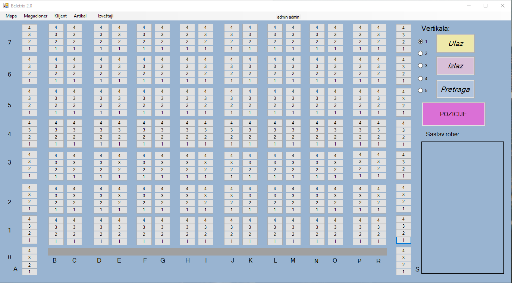
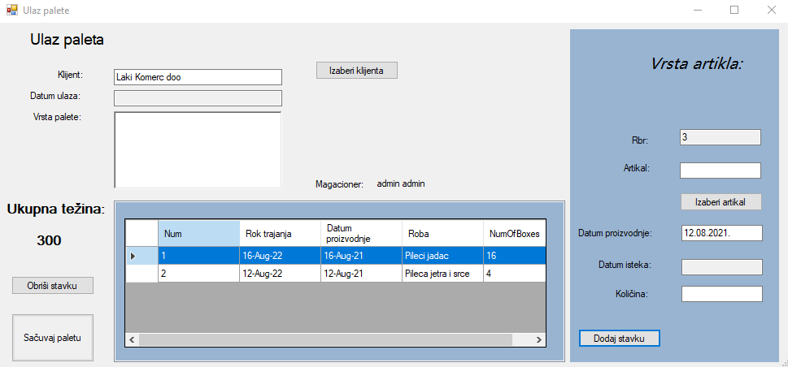
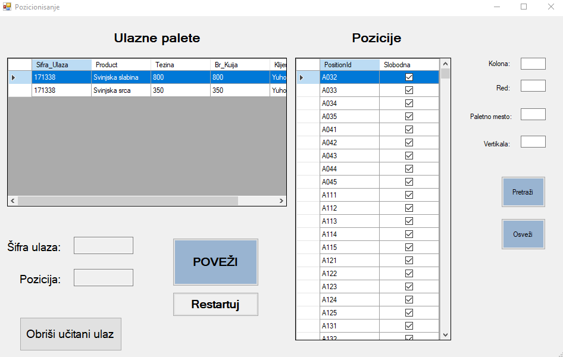
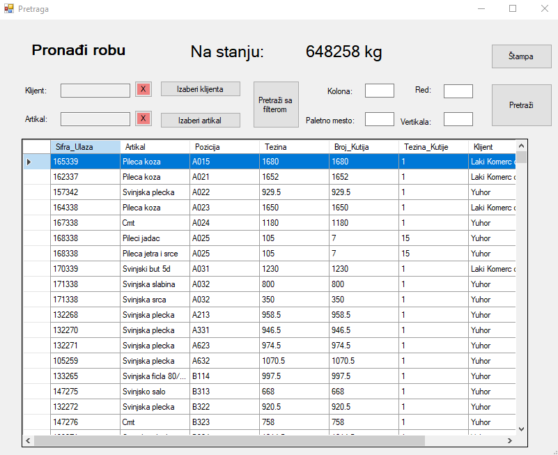

# Beletrix-2.0
Beletrix 2.0 is desktop application developed in .Net Framework using C# language. The main function is records of goods pallets in rack warehouses. Currently is used by Laki Komerc company in Jagodina.

## Design

Home Page                  |  Adding Entrance           |  Positioning              |  Search
:-------------------------:|:-------------------------:|:-------------------------: |:-------------------------:
  |   |  | 
